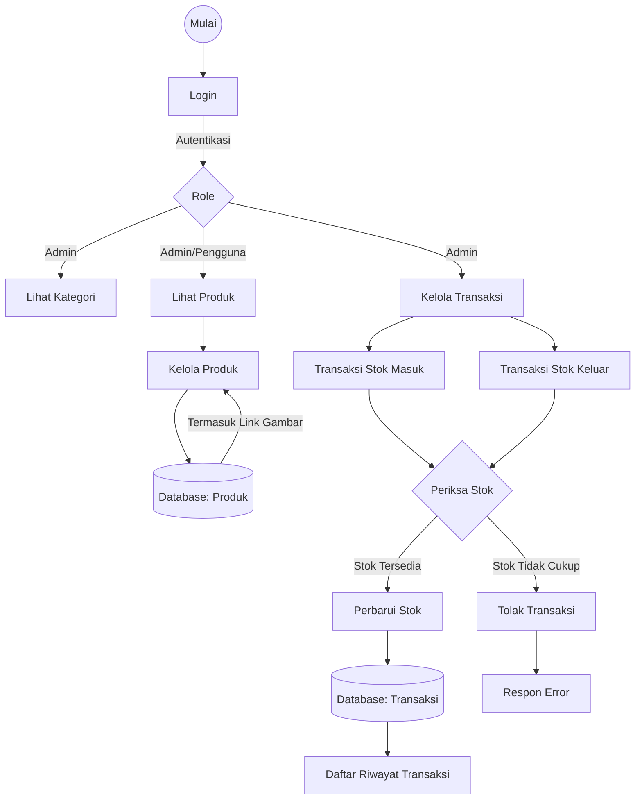
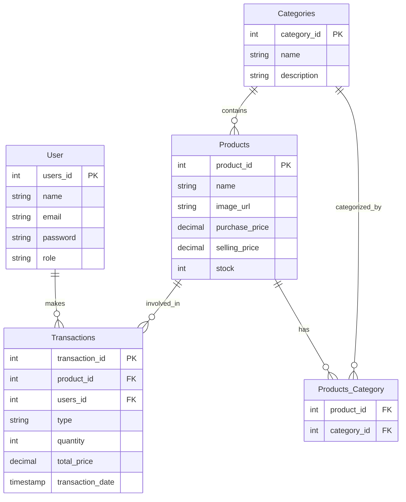

# Dokumentasi Inventory Aplikasi

## FlowChart

## ERD Diagram

## User Requirement

| ID                      | UR-01                                                                                                                                                   |
| ----------------------- | ------------------------------------------------------------------------------------------------------------------------------------------------------- |
| **Judul**               | Manajemen Produk                                                                                                                                        |
| **Aktor**               | Admin                                                                                                                                                   |
| **Deskripsi**           | Admin dapat menambahkan, melihat, mengedit, dan menghapus data produk yang mencakup informasi nama, harga beli, harga jual, stok, gambar, dan kategori. |
| **Tujuan**              | Memudahkan admin dalam mengelola data produk yang tersedia di sistem, sehingga data selalu up-to-date dan akurat.                                       |
| **Kriteria Penerimaan** | - Admin dapat melihat seluruh daftar produk lengkap dengan kategori.                                                                                    |

| ID                      | UR-02                                                                                                        |
| ----------------------- | ------------------------------------------------------------------------------------------------------------ |
|                         |                                                                                                              |
| **Judul**               | Admin Melakukan Transaksi dan Melihat Riwayat Transaksi                                                      |
| **Aktor**               | Admin                                                                                                        |
| **Deskripsi**           | Admin dapat membuat transaksi pembelian produk dan melihat daftar riwayat transaksi.                         |
| **Tujuan**              | Memungkinkan admin mencatat pembelian produk ke sistem dan mengecek histori transaksi yang pernah dilakukan. |
| **Kriteria Penerimaan** | - Admin dapat memilih produk dan jumlahnya untuk membuat transaksi baru.                                     |
