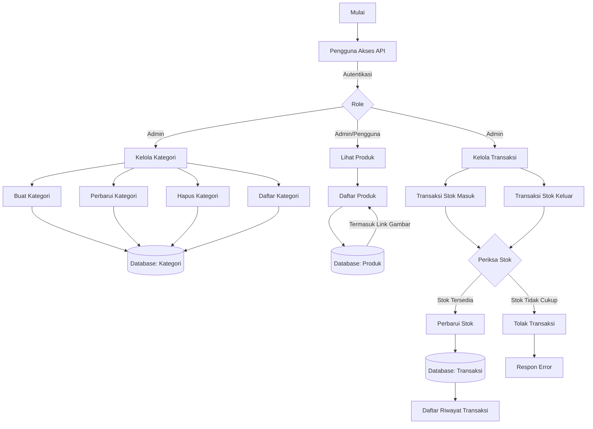
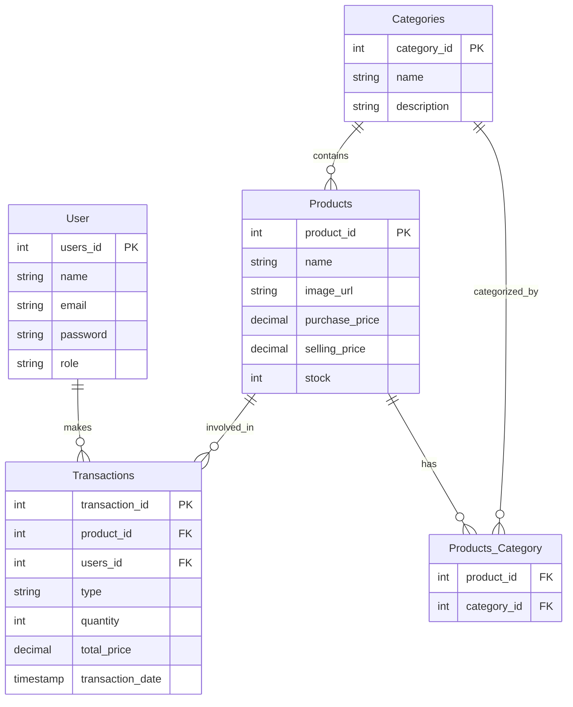

```mermaid
flowchart TD
    A[Mulai] --> B[Pengguna Akses API]
    B -->|Autentikasi| C{Role}
    C -->|Admin| D[Kelola Kategori]
    C -->|Admin/Pengguna| E[Lihat Produk]
    C -->|Admin| F[Kelola Transaksi]

    D --> D1[Buat Kategori]
    D --> D2[Perbarui Kategori]
    D --> D3[Hapus Kategori]
    D --> D4[Daftar Kategori]
    D1 --> G[(Database: Kategori)]
    D2 --> G
    D3 --> G
    D4 --> G

    E --> E1[Daftar Produk]
    E1 --> H[(Database: Produk)]
    H -->|Termasuk Link Gambar| E1

    F --> F1[Transaksi Stok Masuk]
    F --> F2[Transaksi Stok Keluar]
    F1 --> I{Periksa Stok}
    F2 --> I
    I -->|Stok Tersedia| J[Perbarui Stok]
    I -->|Stok Tidak Cukup| K[Tolak Transaksi]
    J --> L[(Database: Transaksi)]
    K --> M[Respon Error]
    L --> N[Daftar Riwayat Transaksi]

    A:::start
    B:::process
    C:::decision
    D:::process
    E:::process
    F:::process
    D1:::process
    D2:::process
    D3:::process
    D4:::process
    E1:::process
    F1:::process
    F2:::process
    I:::decision
    J:::process
    K:::error
    M:::error
    N:::process
    G:::data
    H:::data
    L:::data

    classDef start shape:circle
    classDef process shape:rect
    classDef decision shape:diamond
    classDef data shape:cylinder
    classDef error shape:rect


```

```mermaid
erDiagram
    User ||--o{ Transactions : makes
    Categories ||--o{ Products : contains
    Products ||--o{ Transactions : involved_in
    Categories ||--o{ Products_Category : categorized_by
    Products ||--o{ Products_Category : has

    User {
        int users_id PK
        string name
        string email
        string password
        string role
    }

    Categories {
        int category_id PK
        string name
        string description
    }

    Products {
        int product_id PK
        string name
        string image_url
        decimal purchase_price
        decimal selling_price
        int stock
    }

    Products_Category {
        int product_id FK
        int category_id FK
    }

    Transactions {
        int transaction_id PK
        int product_id FK
        int users_id FK
        string type
        int quantity
        decimal total_price
        timestamp transaction_date
    }

```
